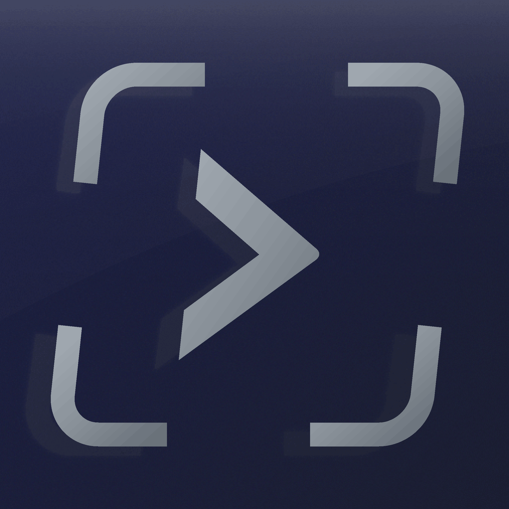

<p align="center">
  
</p>

<h1 align="center">clickterm</h1>

<p align="center">
  <strong>A mouse-driven tmux development environment with a native macOS app.</strong>
</p>

<p align="center">
  <a href="https://github.com/goov373/tmux-clickterm/blob/main/LICENSE"></a>
  <a href="https://github.com/goov373/tmux-clickterm/releases"></a>
  
  
</p>

<p align="center">
  <a href="#quick-start">Quick Start</a> &bull;
  <a href="#features">Features</a> &bull;
  <a href="#status-bar-buttons">Buttons</a> &bull;
  <a href="docs/ARCHITECTURE.md">Architecture</a> &bull;
  <a href="docs/EXTENDING.md">Extending</a>
</p>

---

## Philosophy

**Click buttons instead of memorizing keyboard shortcuts.**

clickterm is for developers who prefer GUI-style interactions over memorizing complex key combinations. Every action is just one click away in the status bar.

---

## Quick Start

```bash
# Clone and build
git clone https://github.com/goov373/tmux-clickterm.git
cd tmux-clickterm
./app/build-app.sh
cp -r app/build/clickterm.app /Applications/
```

Then launch **clickterm** from your Applications folder or Dock.

---

## Features

| Feature | Description |
|---------|-------------|
| **Native macOS App** | Proper Dock icon, click to launch, no duplicate icons |
| **Mouse-Driven Workflow** | Click status bar buttons for all common tmux actions |
| **Nord Dark Theme** | Beautiful, consistent colors across iTerm2, tmux, and AI tools |
| **Smart Pane Management** | Split limits, busy-pane detection, last-pane protection |
| **AI Tool Launchers** | One-click OpenCode and Claude Code buttons |
| **Safe Defaults** | Confirmations before destructive actions |

---

## How It Works

clickterm is a native Swift app that:
1. Launches iTerm2 with a tmux session
2. Installs clickable button scripts on first run
3. Provides a clickable status bar for all common actions

```
┌─────────────────────────────────────────────────────────────────────────┐
│                              iTerm2                                      │
│  ┌───────────────────────────────────────────────────────────────────┐  │
│  │                              tmux                                  │  │
│  │  ┌─────────────────────────────────────────────────────────────┐  │  │
│  │  │                                                              │  │  │
│  │  │                     Your Terminal Panes                      │  │  │
│  │  │                                                              │  │  │
│  │  └─────────────────────────────────────────────────────────────┘  │  │
│  │                                                                    │  │
│  │  ┌─────────────────────────────────────────────────────────────┐  │  │
│  │  │ [ Split ] [ Stack ] [ Close ] [ Exit ] [ ? ] [ opencode ]   │  │  │
│  │  └─────────────────────────────────────────────────────────────┘  │  │
│  │                          ↑ Click these buttons                     │  │
│  └───────────────────────────────────────────────────────────────────┘  │
└─────────────────────────────────────────────────────────────────────────┘
```

---

## Status Bar Buttons

| Button | Action |
|--------|--------|
| `[ │ Split ]` | Split pane vertically (side by side) |
| `[ ─ Stack ]` | Split pane horizontally (stacked) |
| `[ × Close ]` | Close current pane (protected - can't close last pane) |
| `[ ⎋ Exit ]` | Send Ctrl+C to stop current program |
| `[ ? ]` | Show help popup |
| `[ opencode ]` | Launch OpenCode AI assistant |
| `[ claude ]` | Launch Claude Code AI assistant |

---

## Alternative: Scripts Only

If you prefer to use your own terminal setup:

```bash
./install.sh
tmux new-session -A -s clickterm
```

This installs the scripts and tmux configuration without the macOS app wrapper.

---

## Requirements

| Requirement | Version |
|-------------|---------|
| macOS | 12+ |
| tmux | 3.0+ |
| iTerm2 | Latest recommended |

---

## Performance Tips

For the smoothest pane resize experience, ensure these iTerm2 settings:

1. **Enable GPU Rendering**  
   Settings → General → Magic → **GPU Rendering** ✓

2. **Disable Throughput Mode**  
   Settings → General → Magic → **Disable** "Maximize throughput..."  
   (Allows higher frame rate during drag operations)

---

## Project Structure

```
tmux-clickterm/
├── app/                        # Native macOS app
│   ├── clickterm/main.swift    # Swift source
│   ├── build/clickterm.app     # Built app bundle
│   └── build-app.sh            # Build script
├── configs/                    # Configuration files
│   ├── tmux.conf               # Main tmux configuration
│   └── iterm2/Nord.json        # iTerm2 color profile
├── docs/                       # Documentation
│   ├── ARCHITECTURE.md         # Technical deep-dive
│   └── EXTENDING.md            # How to add features
├── assets/                     # Logos and icons
├── *.sh                        # Handler scripts
├── tmux-theme.conf             # Nord Dark theme + buttons
└── install.sh                  # Manual installation
```

---

## Development

```bash
make dev          # Install scripts + reload tmux
make lint         # Run shellcheck on all scripts
```

See [EXTENDING.md](docs/EXTENDING.md) for how to add new buttons and features.

---

## Documentation

- **[Architecture](docs/ARCHITECTURE.md)** - Technical deep-dive into how clickterm works
- **[Extending](docs/EXTENDING.md)** - Step-by-step guides for adding features
- **[AI Development Guide](AGENTS.md)** - Context for AI coding assistants

---

## Changelog

### v1.1.0
- Fixed duplicate iTerm dock icon issue
- Reorganized logo assets
- App now reuses existing iTerm instance

### v1.0.0
- Native macOS app for Dock integration
- Opens in new iTerm window (not tab)
- Auto-installs scripts on first run
- Nord Dark theme

---

## Contributing

Contributions are welcome! Please read the [AGENTS.md](AGENTS.md) file for coding conventions and development workflow.

---

## License

[MIT](LICENSE)
